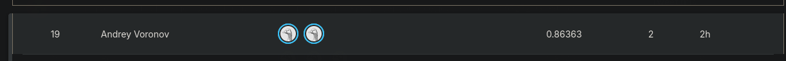

# CSE 144 Final Project - Transfer Learning Challenge

**Kaggle public leaderboard score: 0.86363**
 


**Team:** Sam Hutchins, Andrey Voronov


## install requirements

```bash
pip install -r requirements.txt
```

## setting up kaggle token
Authentication

Before accessing the API, you need to authenticate using an API token. To do this:

    Go to the 'Account' tab on your Kaggle profile.
    Click 'Create New Token'. This will download a file named kaggle.json containing your API credentials.
    Move this file to the appropriate location:
        Linux/OSX: ~/.kaggle/kaggle.json
        Windows: C:\Users&lt;Windows-username&gt;\.kaggle\kaggle.json

Make sure the permissions are set correctly to keep the file secure.
```bash
chmod 600 ~/.kaggle/kaggle.json
```

## Training

Run CSE-144_FINAL.ipynb top to bottom in supporting jupyter notebook editor.

1. Downloads the competition data with kagglehub
2. Builds a stratified 80/20 tran/validation split (868/211 images, seed 42).
3. Trains the classifier head for 25 epochs, checkpointing the best validation-accuracy model to ./checkpoints/best_convnext_small.pt

## Inference
1. Checkpoint **[best_convnext_small.pt](https://drive.google.com/file/d/1BiEXp_Nmf7-2lxfw2U4wJou2gtCy_gl6/view?usp=sharing)**
2. Place checkpoint at ./checkpoints/best_convnext_small.pt (relative to notebook)
3. Run the notebook's setup cells (import, dataset/transform, model definition), skip training loop cell.
4. Run Testing section

## Trained model weights
[Google Drive](https://drive.google.com/file/d/1BiEXp_Nmf7-2lxfw2U4wJou2gtCy_gl6/view?usp=sharing)
